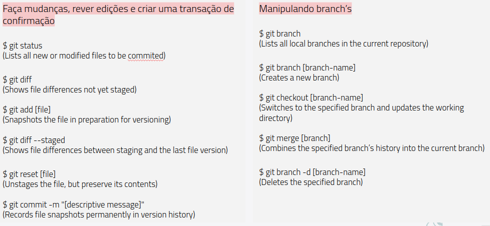

## Git Poc
Este projeto foi criado com o intuito de servir como insumo para praticar Git.

Este artigo ira apresentar uma breve síntese sobre Git, GitHub e dicas da utilização do Git juntamento com a IDE de desenvolvimento IntelliJ.

## O que é o Git?
O git é um sistema de controle de versão desenvolvido por Linus Torvalds. Com ele podemos controlar alterações em um projeto. 

Pode ser facilmente baixado e instalado conforme orientações do [site oficial do Git](https://git-scm.com/downloads).

## O que é o Git Flow?
É um conjunto de diretrizes utilizados para organização de branchs.

* master: Contém o nosso código de produção, em algum momento ocorrerá o merge(junção) para este branch.
* release/*: Branch mais estável que a develop.
* develop: Possui todo código da master, mais o que foi desenvolvido.
* feature/*: São branch’s de novas funcionalidades do projeto.
* hotfix/*: São branch’s baseadas na master, utilizados para correções críticas em produção.

## Principais comandos do Git

## Fluxo básico de interações do Git

### Explorando os comando

*  $git checkout [Número do commit] → Retorna o branch até a versão do commit especificado é possível gerar uma branch com base nela, caso necessário.

*  $git checkout -- [Arquivo específico]  → Reverte todas as alterações de um arquivo específico, antes das alterações serem adicionadas.
*  $git checkout . → Reverte todas as alterações, antes das alterações serem adicionadas.
*  $git checkout -- HEAD [nome do arquivo] → Remover as alterações após já ter havido a adição.
*  $git revert [Número do commit]   → Reverter o commit.
*  $git diff [commit 1] [commit 2] → Comparar dois commit.
*  $git reset [commit] → Reseta o repositório até determinado commit.
*  $git reset --hard [commit] → Remove todas as alterações do commit especificado.
*  $git reset HEAD~[n] → Remove N commits, onde N1 e o último commit “...1”. Utilizando o git reset as alterações dos commit são removidas, dessa forma as mesmas devem ser adicionadas e commitadas.
*  $git reset HEAD~1 --hard → Remove na totalidade as alterações do commit, não é necessário a realizar commits posteriores.
*  $git rebase → Este comando reorganiza os commit da branch que está recebendo o “merge” da master, ou seja, o branch local está sendo atualizado, após resolver os conflitos deve ser executado o comando $git add . -> $git rebase --continue para que ocorra a submissão.
*  $git fetch → Baixa as atualizações da banch remota mas não as aplica no repositório local. O comando $git pull nada mais é que a execução do $git fetch + $git merge, no entanto se utilizarmos os comando $git fetch + $git rebase a integridade do histórico fica preservada.
*  $git tag [name tag] → De forma abstrata podemos defini-la como um branch no qual não é possível realizar alteração, uma imagem estática de uma versão do código. O comando $git tag listará todas as tags do branch, caso a tag tenha sido criada local podemos enviá-la para o branch remoto com o comando $git push [remote] [name tag]
*  $git commit --amend → Altera a descrição do último commit, caso exista algum arquivo editado ele será submetido ao finalizar as alterações.
*  $git commit -m“[Mensagem do commit]” → Efetua commit com a mensagem.
*  $git stash → Caso seu branch esteja sujo, ou seja, possui implementações e você necessite trocar de branch utiliza o git stash para guardá-las sem ter necessitadas de commita-las.
*  $git stash list → lista a pilha de stash.
*  $git stash pop → Remove o último item empilhado e o aplica no branch.
*  $git cerry-pick [branch ~2] → Puxa as alterações/histórico de um commit de uma branch especificada para a branch atual e ira gerar um novo commit. O ~2 referência o penúltimo commit da branch específica.
*  $git blame → Mostra as alterações realizadas em um arquivo por linha, apresenta o commit e a pessoa que o realizou. 
*  $git bisect → O funcionamento é similar ao comando blame, porém de forma binária, ideal para identificar alterações de comportamento. Inicie o comando $git bisect start, informe um commit que já possui o erro ($git bisect bad [commit]) e outro que não possua ($git bisect good [commit]). Ira ser realizada a busca binária, para navegar pelas opções retornadas utiliza $git bisect bad, com o commit que realizou a alteração utilize o comando $git bisect reset para sair do modo bisect.

## O que é o Github?
É um serviço web gratuito de hospedagem de código fonte que utiliza o Git no seu controle de versão. Dentre os utilizadores de Git o Github e preferência por possuir um viés de rede social. Para criar uma conta basta acessar o [site oficial do GitHub](https://github.com/).

O Github possui como principais vantagens a característica de portfólio, integração com o Git, compartilhamento de projeto, rede social e possibilita o aprendizado contínuo.

## GitHub pages

O GitHub Pages e uma hospedagem de uma web page estática para o repositório, para criar a página basta acessar o seu repositório Settings/Options/GitHub Pages.

## Tips IntelliJ com o controle de versão Git e repositório GitHub

